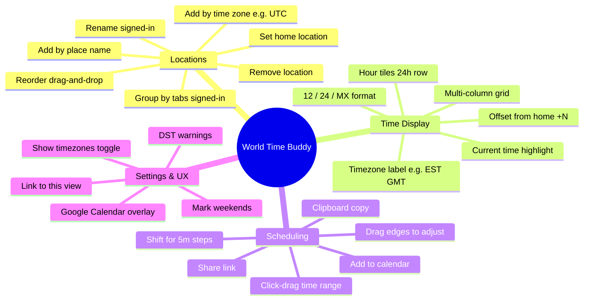
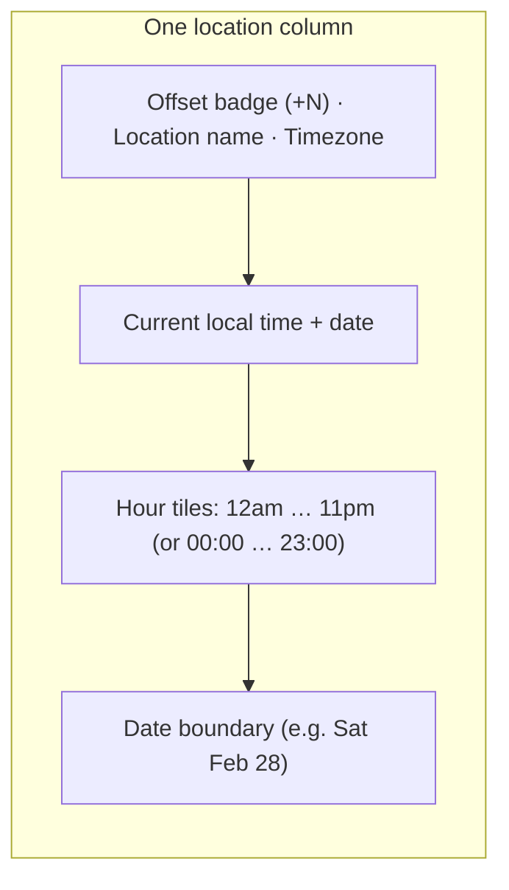
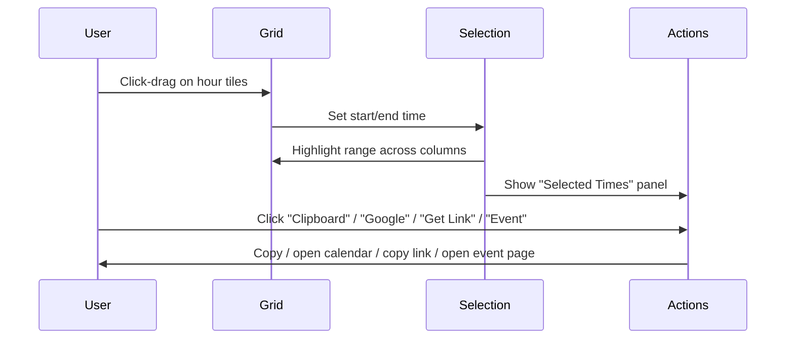
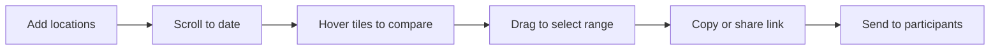
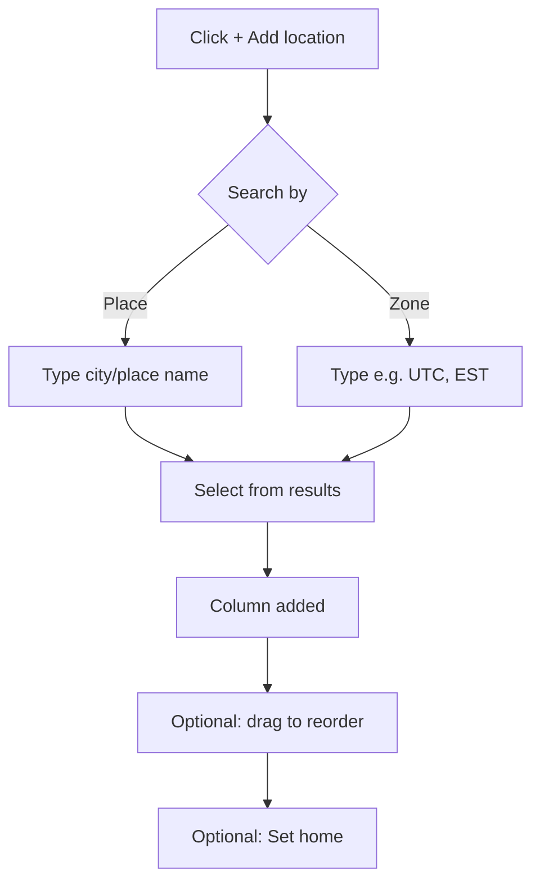
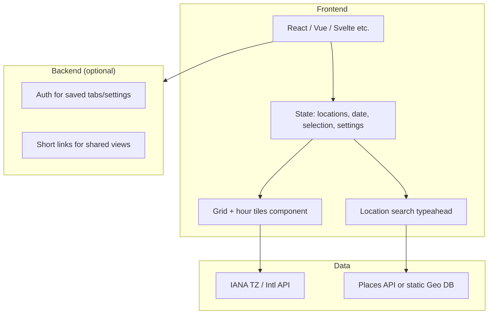

# World Time Buddy — Product Specification (Basis for Clone)

Analysis of [World Time Buddy](https://www.worldtimebuddy.com/) for building a similar world clock and time zone converter. Ads and third-party tracking are out of scope.

---

## 1. Product Overview

World Time Buddy (WTB) is a **world clock**, **time zone converter**, and **online meeting scheduler**. It targets users who travel, join calls across time zones, or coordinate with people abroad.

**Core value:** Compare multiple time zones at a glance and pick meeting times without manual conversion.

---

## 2. Core Features Summary



---

## 3. Full Feature List

### 3.1 Location Management

| Feature           | Description                                                      | Auth |
| ----------------- | ---------------------------------------------------------------- | ---- |
| Add location      | Search by city/place or time zone (e.g. UTC, EST)                | No   |
| Remove location   | Remove a column from the grid                                    | No   |
| Set home          | Mark one location as “home”; offsets and ordering can respect it | No   |
| Reorder locations | Drag-and-drop to change column order                             | No   |
| Rename location   | Custom label for a location                                      | Yes  |
| Group by tabs     | Organize location sets into named tabs                           | Yes  |

### 3.2 Time Display & Grid

| Feature              | Description                                                             |
| -------------------- | ----------------------------------------------------------------------- |
| Multi-timezone grid  | One column per location; rows = hours (default 24h view).               |
| Hour tiles           | Each cell = one hour in that location’s local time.                     |
| Current time         | Visual indicator (e.g. “now” line or highlight) across columns.         |
| Date per column      | Show date (e.g. Fri Feb 27) per location when it differs.               |
| Timezone label       | Abbreviation or name (e.g. EST, GMT, EET) next to location.             |
| Offset from home     | e.g. “+2” meaning 2 hours ahead of home; “+0” for home.                 |
| Hover on offset      | Tooltip with timezone details (e.g. full name, DST).                    |
| Weekend highlighting | Optional highlight for Sat/Sun (configurable for non–Sat/Sun weekends). |
| Show timezones       | Settings toggle to show or hide timezone names.                         |

### 3.3 Hour Format

| Option          | Behavior                                             |
| --------------- | ---------------------------------------------------- |
| 12-hour (am/pm) | All locations in 12h format.                         |
| 24-hour         | All locations in 24h format.                         |
| MX (mixed)      | Each location in its “native” format (locale-based). |

### 3.4 Scheduling & Selection

| Feature              | Description                                                    |
| -------------------- | -------------------------------------------------------------- |
| Select time range    | Click and drag on hour tiles to select a span.                 |
| Adjust selection     | Drag left/right edges of selection to extend or shrink.        |
| Fine adjustment      | Hold Shift while dragging for 5-minute increments.             |
| Selected times panel | When a range is selected: show “Selected Times” with actions.  |
| Copy to clipboard    | Copy selected range in a readable text format.                 |
| Calendar export      | Add to Outlook/iCal, Google Calendar (links or export).        |
| Gmail                | Open Gmail with pre-filled time/date for event.                |
| Get link             | URL that encodes current view + selection (shareable).         |
| Link to this view    | URL for current locations + date (no selection).               |
| Event page           | Public page for one event that others can open (event widget). |

### 3.5 Calendar Integration

| Feature                 | Description                                                                 |
| ----------------------- | --------------------------------------------------------------------------- |
| Google Calendar overlay | Optional overlay of user’s Google Calendar to see busy/free (via Settings). |
| Outlook / iCal          | Export or open in desktop calendar.                                         |
| Google Calendar         | Open or add event in Google Calendar.                                       |

### 3.6 Settings & Persistence

| Feature           | Description                                                       |
| ----------------- | ----------------------------------------------------------------- |
| Show timezones    | Toggle timezone names next to locations.                          |
| Mark weekends     | Toggle weekend highlighting.                                      |
| Calendars…        | Configure calendar integrations (e.g. Google).                    |
| Sign in           | Email or Facebook; used to save locations, tabs, preferences.     |
| Link to this view | Share current state via URL (locations, date, maybe hour format). |

### 3.7 DST & Timezone Details

| Feature           | Description                                                     |
| ----------------- | --------------------------------------------------------------- |
| DST warnings      | Notice shown ~1 week before a location’s DST change.            |
| Timezone on hover | Hover on offset/label to see full timezone info and DST status. |

### 3.8 Widgets (Embeddable)

| Widget             | Purpose                                                                             |
| ------------------ | ----------------------------------------------------------------------------------- |
| World Clock Widget | Embeddable clock: multiple locations, “Your Time” row, visitor’s timezone detected. |
| Event Widget       | Embeddable view for a single event (e.g. webinars).                                 |

---

## 4. UI Structure and Layout

### 4.1 High-Level Layout

```mermaid
flowchart TB
  subgraph Header
    Logo[Logo / Brand]
    Nav[Widgets · Mobile · Features]
    Auth[Sign In]
    HourFormat[am pm | 24 | MX]
    Share[Link to this view]
    Settings[Settings]
  end

  subgraph Toolbar
    CalNav[← 26 Feb 27 28 1 2 3 4 →]
    Export[Outlook · Google · Clipboard · Gmail · Get Link · Event]
  end

  subgraph Main["Main Grid"]
    Col1[Location 1 column]
    Col2[Location 2 column]
    Col3[Location 3 column]
    ColN[+ Add location]
  end

  subgraph Footer
    About[About / Getting Started]
  end

  Header --> Toolbar
  Toolbar --> Main
  Main --> Footer
```

### 4.2 Main Grid Structure (Per Location Column)



- **Top:** Offset from home (e.g. +0, +2), location name, timezone abbreviation.
- **Below:** Large current time and date for that location.
- **Body:** Scrollable or visible hour strip; each cell is one hour, clickable/draggable for selection.
- **Bottom:** Date change row when the next day starts.

### 4.3 Selection and Actions Flow



---

## 5. Interaction Details

### 5.1 Location Strip (Per Column)

| Element           | Interaction                                                             |
| ----------------- | ----------------------------------------------------------------------- |
| Offset badge (+N) | Hover: timezone details tooltip.                                        |
| Location name     | Click: open context menu (Remove, Set home, Rename if signed in, etc.). |
| Add location (+)  | Click: open search (place or time zone); new column added.              |
| Column reorder    | Drag column header to reorder.                                          |

### 5.2 Hour Tiles

| Action                  | Result                                                                        |
| ----------------------- | ----------------------------------------------------------------------------- |
| Hover                   | Show converted times in other columns for that hour (at-a-glance conversion). |
| Click + drag            | Start selection; release to set end.                                          |
| Drag selection edge     | Resize selection (whole hours or 5 min with Shift).                           |
| Click on tile (no drag) | Optional: set single-hour selection or open quick-add.                        |

### 5.3 Date / Navigation

| Element                  | Interaction                          |
| ------------------------ | ------------------------------------ |
| Date strip (26, 27, 28…) | Click date to jump grid to that day. |
| Arrows                   | Previous/next day (or week).         |
| “Today”                  | Jump to current date.                |

### 5.4 Selected Times Panel

Shown when a range is selected:

- **Selected Times** — e.g. “Fri 2pm – 4pm EST” and equivalent in other zones.
- **Add to:** Outlook / iCal, Google Calendar, Clipboard, Gmail.
- **Get Link** — copy URL that includes selection.
- **Link to this selection** / **Event** — create shareable event page or link.

### 5.5 Settings Panel

- **Show timezones** — show/hide timezone labels.
- **Mark weekends** — enable weekend highlighting (and optionally locale).
- **Calendars…** — connect Google Calendar, etc.

### 5.6 Top Bar

- **am pm | 24 | MX** — switch hour format; applies to whole view.
- **Link to this view** — copy URL for current locations + date (and optionally format).
- **Settings** — open settings.

---

## 6. User Flows

### 6.1 “Find a meeting time” (core flow)



### 6.2 “Add and organize locations”



### 6.3 “Share this view”

```mermaid
flowchart LR
  A[Arrange locations + date] --> B[Click "Link to this view"]
  B --> C[URL copied]
  C --> D[Paste in email/chat]
  D --> E[Recipient opens same view]
```

---

## 7. Data and Technologies (Inferred)

### 7.1 Data Sources (from WTB About)

| Source                                                       | Use                                                 |
| ------------------------------------------------------------ | --------------------------------------------------- |
| [IANA TZ Database (TZDATA)](https://www.iana.org/time-zones) | Offsets, DST rules, timezone identifiers.           |
| [GeoNames](https://www.geonames.org/)                        | Place names and coordinates for search and display. |

For a clone you need:

- **Timezone data:** IANA TZDB (e.g. via `Intl`, or a library that uses it).
- **Place → timezone:** Either GeoNames or a similar DB (or API) that maps city/country to IANA timezone.

### 7.2 Technical Building Blocks



- **Frontend:** SPA; state for locations, selected date, selected range, hour format, toggles (timezones, weekends).
- **Time math:** Use IANA-aware APIs (e.g. `Intl`, or libraries like `luxon`/`date-fns-tz`) so DST and offsets are correct.
- **URL state:** Encode locations (IDs or names), date, and optionally selection in query params so “Link to this view” works.
- **Auth (optional):** For saved tabs, reorder, rename; can be minimal (e.g. email + session).
- **Widgets:** Embeddable iframes or script that reads URL params and renders the same grid logic with a fixed set of locations or event.

### 7.3 Key Technical Considerations

| Area          | Notes                                                                               |
| ------------- | ----------------------------------------------------------------------------------- |
| Time zones    | Use IANA identifiers (e.g. `America/New_York`); avoid fixed offsets for scheduling. |
| DST           | All calculations via TZDB; show warnings when a location’s DST changes soon.        |
| Date line     | Handle “same moment, different calendar date” across columns.                       |
| Weekend rules | Default Sat/Sun; allow different weekend definitions per locale if needed.          |
| Share links   | Keep URLs short (e.g. short IDs for saved views) or compress state.                 |

---

## 8. Widgets (Embeddable Products)

### 8.1 World Clock Widget

- **Purpose:** Embed on blogs, event pages, webinars.
- **Content:** Multiple locations in same hour-tile style; “Your Time” row with visitor’s timezone.
- **Customization:** Locations, colors, labels.
- **Output:** Embed code (iframe or script tag).

### 8.2 Event Widget

- **Purpose:** Single event (e.g. “Webinar: March 5, 3pm EST”).
- **Content:** One time shown in multiple time zones.
- **Output:** Embed code or link to event page.

---

## 9. Out of Scope for This Spec

- Ads and ad tech.
- Exact visual design (fonts, colors, spacing).
- Mobile app (only web clone in scope unless specified).
- Detailed copy and legal (Privacy, ToS).

---

## 10. Summary: MVP Feature Set for a Clone

**Must have:**

1. Add/remove locations by place or time zone.
2. Grid: one column per location, hour tiles, current time, dates.
3. 12/24 hour format.
4. Click-drag time range selection.
5. Copy selection to clipboard.
6. “Link to this view” (URL with locations + date).
7. Timezone labels and offset from “home”.
8. Weekend highlighting (toggle).
9. IANA + place data (TZDATA + GeoNames or equivalent).

**Should have:**

10. Set home; reorder by drag.
11. Resize selection (drag edges; Shift for 5 min).
12. Calendar export (Google, iCal/Outlook).
13. “Get link” for selection (shareable event).
14. Hover on offset for timezone details.
15. DST warnings.

**Nice to have:**

16. Sign in and save tabs / reorder / rename.
17. Google Calendar overlay.
18. Event page and embeddable widgets.
19. MX (mixed) hour format.

---

_Document derived from analysis of worldtimebuddy.com (Feb 2025). Use as basis for a clone; ignore ads and third-party tracking._
